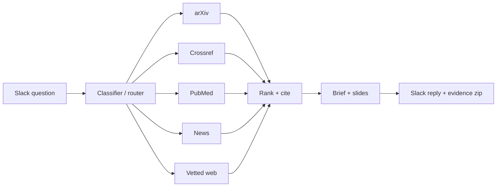

# John Montalbo, PhD

**Senior Data Scientist · Applied Mathematics, Machine Learning, Scientific Computing**
Austin, TX · [LinkedIn](https://linkedin.com/in/john-montalbo-phd) · j.montalb1@gmail.com

I take problems from first-principles formulation to deployed software: inverse problems, physics-based simulation, computer vision, and machine learning. My graduate work was on recovering structure from incomplete measurements — motion from image pairs, images from undersampled radar — and my job since has been turning that kind of math into production systems.

## Selected results

- Detected **100% of labeled defects with zero false-positive regions** in a semiconductor optical-inspection product
- Cut quarterly audit-testing effort **91% (~$60K/yr)** — work behind a 2023 NACo Best-in-Category award
- Co-built and deployed a production **AWS knowledge-graph platform** ingesting 19 live data sources
- Technical lead on a **$600K quantitative-research engagement** whose recommendation the client adopted

## Research

My research has one through-line: recover structure from incomplete or degraded measurements, then put what you recovered to work. In my PhD the measurements were two frames of a video and the structure was the motion between them; in my master's the measurements were undersampled radar signals and the structure was a sparse Fourier representation. Both theses stopped at the point where the ideas needed to be built and tested end to end. These two repositories finish that work. Every number comes from a script in the repo, and I wrote the pass/fail lines into git before running anything, so the misses sit next to the hits.

### [optical-flow-inverse](https://github.com/JCMontalbo/optical-flow-inverse) — my dissertation, built and tested

My dissertation treated optical flow as an inverse problem: recover the motion field between two images (Horn–Schunck, with PDE regularization), and then — the part I cared about — *use* the recovered field. Scale it, gate it inside Gaussian windows, perturb it with area-preserving generators, and propagate the first image forward along the result. Every image you get is a plausible new image, because the motion it was made from was observed, not invented. I proposed this as training-data augmentation for medical imaging, where you cannot flip or rotate a slice without producing an impossible patient, and I ran out of time before I could test it. So the repo does, and it carries the labels along with the images, which is what makes the generated data trainable.

*What you are looking at. **Top left** is the real footage. The red outline is a label of the character drawn on every frame; the cyan outline was drawn on the first frame only and is carried through the clip by the recovered motion field. **The other three panels are not footage** — they are new clips generated from the real one by modifying the recovered motion: in one, the region under the tracked window moves three times as fast; in the others, a localised area-preserving swirl or squeeze pulses through it. The cyan outline in those panels was carried along the same modification as the pixels, so every generated frame arrives with its own label — which is what makes generated data usable for training.*

The same idea moved to the setting it was designed for. Here the "video" is a stack of MRI slices through a patient's heart, the motion between neighbouring slices is recovered the same way, and one annotated slice is enough to label the rest:

*A patient the model never saw. I labelled the left atrium on one slice in the middle of the volume (red is the ground truth on every slice); the cyan outline is that single label carried outward along the recovered slice-to-slice flow — first up through the volume, then back to the seed and down. Seeding in the middle matters: an organ grows and then shrinks as you move through the slices, so a label started at one end would have to survive twice the distance. It holds about ten slices each way — IoU 0.91 at five, 0.83 at ten. Every synthetic slice made by perturbing that flow arrives with its label the same way, which is what let me train on it. That training is the experiment below.*

| setting | labels | recovered-flow augmentation | best alternative | outcome |
|---|---|---|---|---|
| **Cardiac MRI** (MSD Heart, left atrium, 3D Dice on 6 held-out patients) | 1 slice / patient | **0.680** | 0.634 random elastic · 0.568 affine · 0.581 none | **best of five** (+11 over affine, +4.6 over elastic; 3 seeds) |
| | 2 slices / patient | **0.842** | 0.833 elastic | still first, within a point |
| | 4+ slices / patient | 0.868 | 0.885 affine | advantage gone, as I expected |
| **Natural video** (DAVIS 2016, J-mean) | 1–2 frames / video | 0.337 / 0.383 | **0.385 / 0.420** flip-rotate-scale | loses — a flipped bear is still a bear, so flips are free there |

That is the result I hoped for in 2020: the method helps exactly where it was designed to help — anatomy, with very few labels — and fades as labels accumulate. The video result is the boundary of the claim, and it sits in the README next to the MRI result. The repo also has the video work the idea grew out of: streaming augmentation over a clip, new in-between frames validated against held-out real ones (32.9 dB vs 30.0 dB for blending), 4× slow motion, families of synthetic clips, and labels carried through a video from a single annotated frame. 34 tests, CI on Python 3.10–3.13.

### [compressive-imaging](https://github.com/JCMontalbo/compressive-imaging) — my master's thesis, reproduced and carried through

My master's thesis was about keeping less: take a signal's Fourier data, keep only the coefficients whose magnitude clears a threshold, zero the rest, and invert — and show that you lose very little. It derived the radar scattering model from Maxwell's equations, ran the thresholding on signals and images, tried ℓ₁ recovery from non-uniform samples with an off-the-shelf solver, and closed by saying the next step was to write our own solvers and use them inside a radar imaging process. This repo is that next step.

*What you are looking at. **Top row** is the thesis's idea: a natural image rebuilt from only its largest Fourier coefficients, sweeping from 0.05% of them up to 30%, with the coefficients kept drawn in k-space beside it. At 1% the picture is recognisable (8% error); at 5% the error is 4%. **Bottom row** is the radar imaging the thesis pointed at: a 39-scatterer target rebuilt from a growing fraction of its phase-history samples. The same samples give two different answers depending on where you assume sparsity — assume it in the data (zero-fill) and you get noise until well past 40%; assume it in the image (ℓ₁) and the target is there from about 10%. That one decision is the whole radar result.*

| | what I found |
|---|---|
| **The thresholding idea** | Works as claimed on natural images and on tones that sit on the DFT grid. The boundaries are on the same curve: sharp-edged images are not Fourier-compressible (which is why the thesis reaches for total variation on the phantom), and chirps are not compressible in any fixed basis. My §4.1 test signals were aliased off-bin tones and so were never truly sparse — that is why the ℓ₁ step in the thesis needed the original signal. With sparse tones, my own sampler and an interior-point solve recover exactly from **13% of the samples**; TV from 22 radial Fourier lines gives 2.4% error. |
| **The radar imaging the thesis pointed at** | Turntable ISAR built from the thesis's scattering model and sampled at 22.5%. The decision that makes or breaks it is *where* you assume sparsity: in the phase history (15% of its energy in its 39 largest samples) you get F1 0.54; in the image (exactly 39-sparse) you get **0.96, the same as with all the data**, with or without noise. Plus the phase transition, resolving two scatterers 0.6 Fourier cells apart, and motion compensation that works on the compressed samples. |
| **The solvers** | ISTA/FISTA, OMP, CoSaMP, IRLS, ADMM basis pursuit, a log-barrier interior-point method, and Fourier-domain TV, written from scratch and each tested against a property it must satisfy. The interior-point method is the one the thesis said it wanted to learn. |
| **A 2015 noisy-video paper I co-authored** | Its method ranking reproduces (FISTA > IRLS > CoSaMP > OMP); its gain does not on textured footage, where column-DCT sparsity barely beats the noisy input. Motion-compensated residuals from the flow repo add 0.3–0.5 dB; frame differencing hurts. |

**Publications**
- *Sparse Representation for ISAR Image Reconstruction.* Proc. SPIE 9857, 2016.
- *Compressive Sensing for Noisy Video Reconstruction.* Proc. SPIE 9484, 2015.
- PhD dissertation: *Inverse Problems and Forward Propagation of Optical Flow*, UT Arlington, 2020.
- MS thesis: *Compressive Sensing and Radar Imaging*, UT Rio Grande Valley, 2016.

## Systems I've built (private repositories)

Most of my recent work is client-owned and can't be shared as code. At a high level:

- **LLM research agent** — classifies incoming questions, routes them across five retrieval pipelines (arXiv, Crossref, PubMed, news, vetted web), and returns a cited brief plus auto-generated slides in Slack. 161 unit tests; runs as a service on AWS EC2.
- **Physics-based digital twin** of a gas-turbine power plant and hyperscale data center — turbine transients validated 9/9 against published F-class data, power flow, load-forecasting API, React/TypeScript front end.
- **VTOL conceptual-design tool** — momentum-theory hover, cruise, hybrid energy-chain, thermal, and mass models with an inverse solver over ten design levers; 155 automated validation checks against flown prototypes.
- **GPU ray tracer** (CUDA/OpenCL) that renders synthetic reference images directly from OASIS/GDS design files for photomask inspection.

Architecture: LLM research agent

## Toolbox

**ML / CV:** PyTorch, scikit-learn, XGBoost, OpenCV, optical flow, YOLO, GroundingDINO, LLM pipelines (Claude API)
**Math:** inverse problems, PDEs, numerical optimization, Monte Carlo / UQ, signal & image processing, Gaussian-process surrogates
**Systems:** Python, MATLAB, SQL, CUDA/OpenCL, FastAPI, gRPC, Docker, AWS (Lambda, Step Functions, Redshift, Neptune, EC2), Terraform, GitHub Actions

---
Active DoD Secret clearance · Open to Senior / Applied Scientist roles
