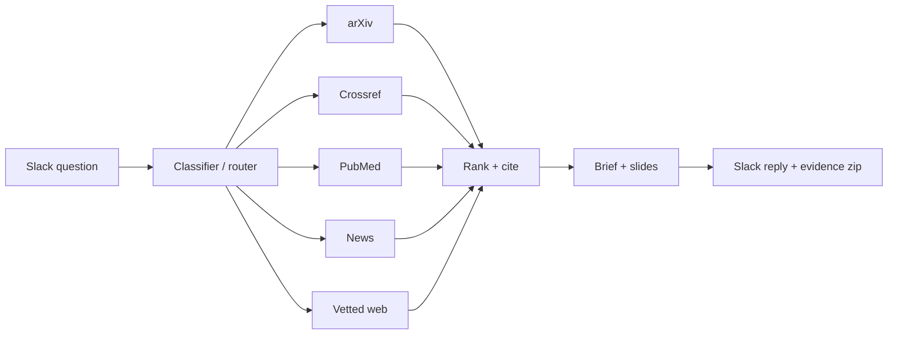

# John Montalbo, PhD

**Senior Data Scientist · Applied Mathematics, Machine Learning, Scientific Computing**
Austin, TX · [LinkedIn](https://linkedin.com/in/john-montalbo-phd) · j.montalb1@gmail.com

I take problems from first-principles formulation to deployed software: inverse problems, physics-based simulation, computer vision, and machine learning. My PhD work was on the mathematics of motion estimation; my day job is turning that kind of math into production systems.

## Selected results

- Detected **100% of labeled defects with zero false-positive regions** in a semiconductor optical-inspection product
- Cut quarterly audit-testing effort **91% (~$60K/yr)** — work behind a 2023 NACo Best-in-Category award
- Co-built and deployed a production **AWS knowledge-graph platform** ingesting 19 live data sources
- Technical lead on a **$600K quantitative-research engagement** whose recommendation the client adopted

## Research

My research is in inverse problems and sparse reconstruction — recovering structure from incomplete or degraded measurements, then using what was recovered to generate new data. The repos below are reproducible re-implementations; every number comes from a script in the repo.

### [optical-flow-inverse](https://github.com/JCMontalbo/optical-flow-inverse) — my dissertation, reimplemented and finally tested

Recover the motion field between two images (Horn–Schunck, a regularized inverse problem), transform it — globally, inside Gaussian windows, or by area-preserving generators — and propagate the first image *and its label* along the result. The dissertation proposed this as training-data augmentation for anatomy, where flipping or rotating an image produces an impossible patient, but never had time to test it. This repo does, with the pass/fail criteria pre-registered in git before each run:

| setting | labels | recovered-flow augmentation | best alternative | verdict |
|---|---|---|---|---|
| **Cardiac MRI** (MSD Heart, left atrium, 3D Dice on 6 held-out patients) | 1 slice / patient | **0.680** | 0.634 random elastic · 0.568 plausible affine · 0.581 none | **wins** (+11 over affine, +4.6 over elastic; 3 seeds) |
| | 2 slices / patient | **0.842** | 0.833 elastic | still first, within 1 pt |
| | 4+ slices / patient | 0.868 | 0.885 affine | advantage gone, as expected |
| **Natural video** (DAVIS 2016, J-mean) | 1–2 frames / video | 0.337 / 0.383 | **0.385 / 0.420** flip-rotate-scale | **loses** — a flipped bear is still a bear |

The claim holds where it was made for and fails where it was never meant to apply; both are in the README. Also in the repo: the flow-based video work (streaming augmentation, held-out frame synthesis at 32.9 dB vs 30.0 dB blend, 4× slow motion, synthetic clip families) and labels carried through video and through an MRI volume from a single annotated slice (IoU 0.91 at 5 slices, 0.83 at 10). 34 tests, CI on 3.10–3.13.

| Topic | What it is | Repo |
|---|---|---|
| **Compressive sensing for radar imaging** | Sparse ISAR reconstruction from undersampled measurements via ℓ₁ minimization (ISTA/FISTA), benchmarked against backprojection. | `cs-radar-imaging` *(coming)* |
| **Compressive sensing for noisy video** | Sparse recovery of video frames from noisy, compressed measurements. | `cs-video-recovery` *(coming)* |

**Publications**
- *Sparse Representation for ISAR Image Reconstruction.* Proc. SPIE 9857, 2016.
- *Compressive Sensing for Noisy Video Reconstruction.* Proc. SPIE 9484, 2015.
- PhD dissertation: *Inverse Problems and Forward Propagation of Optical Flow*, UT Arlington, 2020.

## Systems I've built (private repositories)

Most of my recent work is client-owned and can't be shared as code. At a high level:

- **LLM research agent** — classifies incoming questions, routes them across five retrieval pipelines (arXiv, Crossref, PubMed, news, vetted web), and returns a cited brief plus auto-generated slides in Slack. 161 unit tests; runs as a service on AWS EC2.
- **Physics-based digital twin** of a gas-turbine power plant and hyperscale data center — turbine transients validated 9/9 against published F-class data, power flow, load-forecasting API, React/TypeScript front end.
- **VTOL conceptual-design tool** — momentum-theory hover, cruise, hybrid energy-chain, thermal, and mass models with an inverse solver over ten design levers; 155 automated validation checks against flown prototypes.
- **GPU ray tracer** (CUDA/OpenCL) that renders synthetic reference images directly from OASIS/GDS design files for photomask inspection.

Architecture: LLM research agent

## Toolbox

**ML / CV:** PyTorch, scikit-learn, XGBoost, OpenCV, optical flow, YOLO, GroundingDINO, LLM pipelines (Claude API)
**Math:** inverse problems, PDEs, numerical optimization, Monte Carlo / UQ, signal & image processing, Gaussian-process surrogates
**Systems:** Python, MATLAB, SQL, CUDA/OpenCL, FastAPI, gRPC, Docker, AWS (Lambda, Step Functions, Redshift, Neptune, EC2), Terraform, GitHub Actions

---
Active DoD Secret clearance · Open to Senior / Applied Scientist roles
